## Classifying Disease Mutation data

Created machine learning models in R and Python to classify curves of disease data as mutation or no mutation. 

#### The data
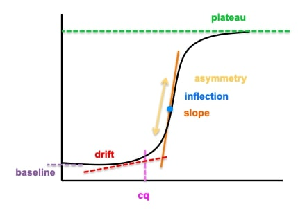

7 variables for learning and response variable True (is mutation) and False (is not).

#### R workflow
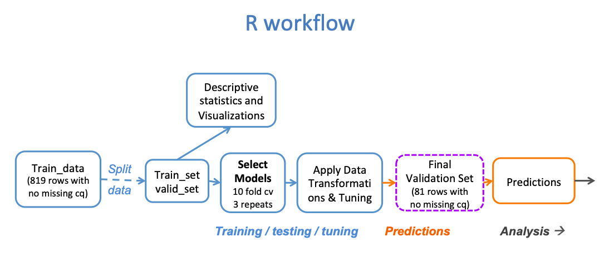

#### R results
All models show promising mean accuracy over 90%
Random Forest performs the best with mean accuracy of 0.99
Yeo-johnson transformation gave best results
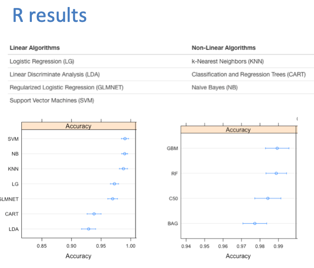

#### Python workflow
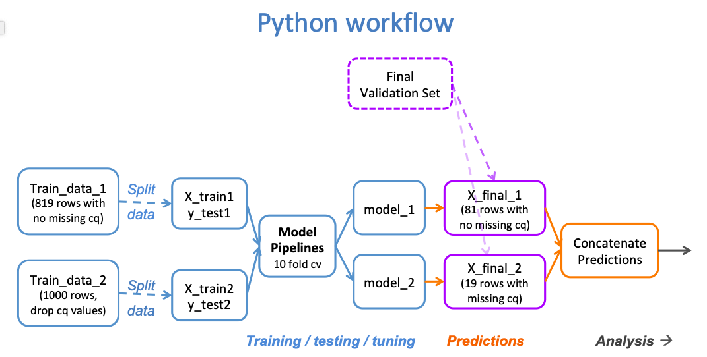

#### Exploratory analysis in Python 
In both the training and validation set, there appears to be correlation variables 
Variation is greater in certain variables 
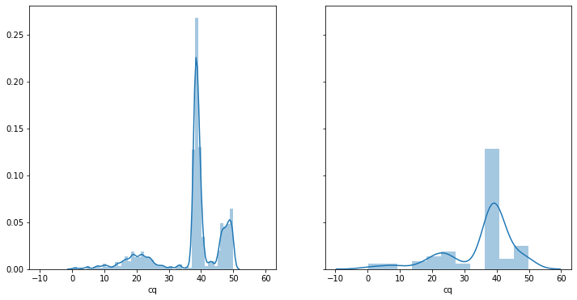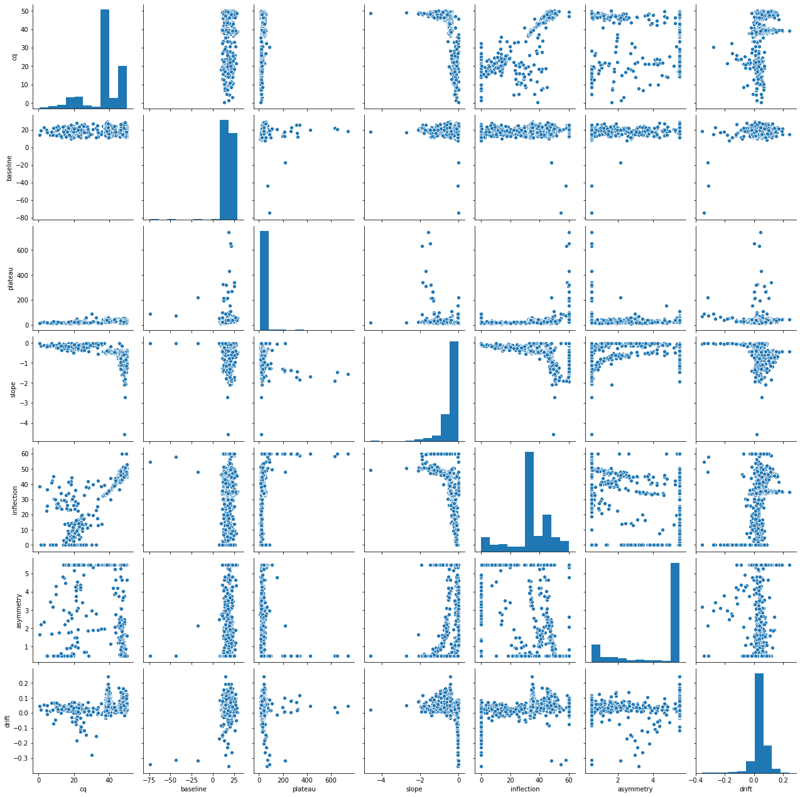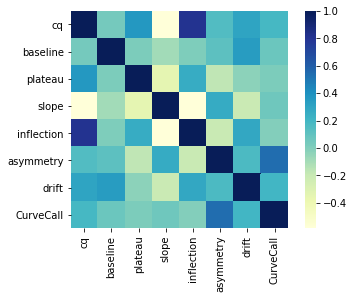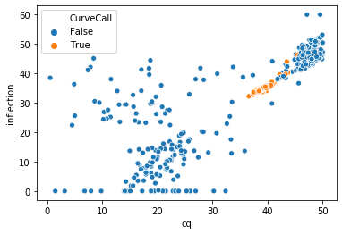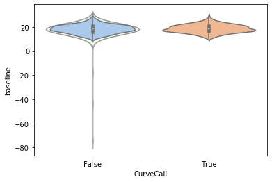

#### Preliminary model comparison Python 
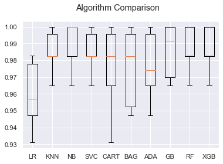
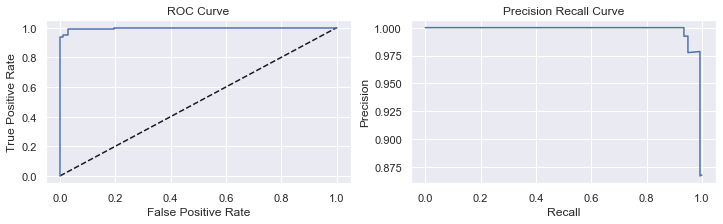
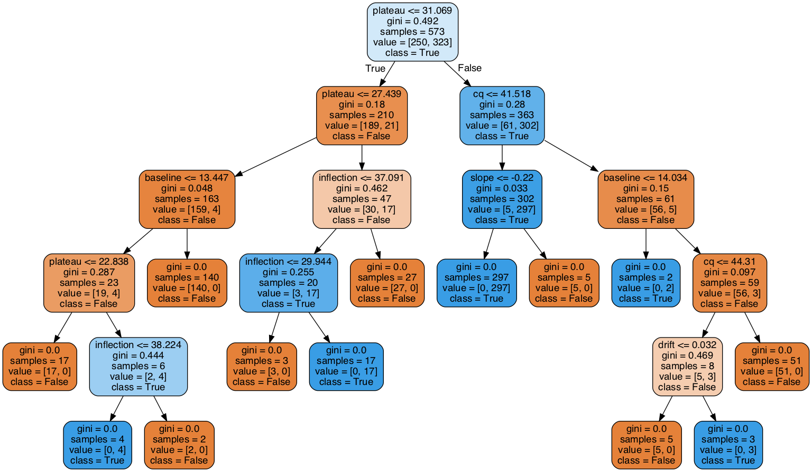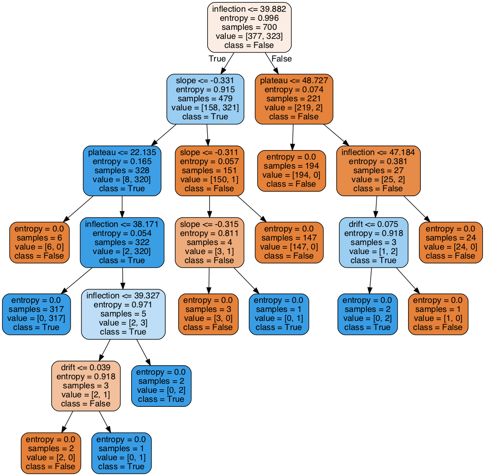

#### Final results (Python and R)
Visualized final predictions as a binary heat map. Out of the 100 test samples, 99 samples were curves were classified correctly--with models in close agreeance. 

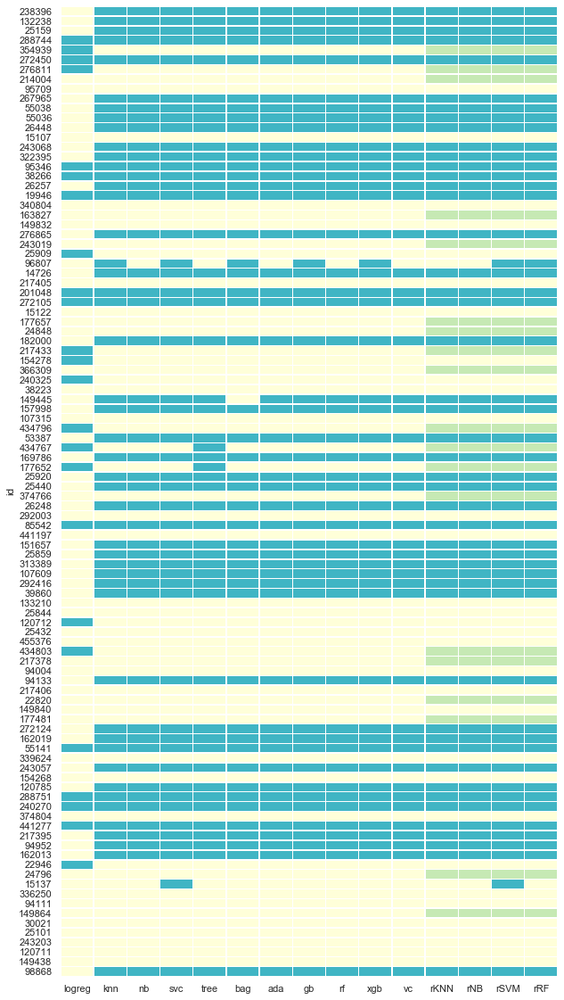

#### Best performing models (in no particular order): 
- Random Forest
- Naive Bayes
- XGBoost Classifier 
- Gradient Boosting Classifier 
- AdaBoost
- K-Nearest Neighbor 
- Voting Classifier 
- Bagging Classifier

Less well performing models(with more tuning better models may be possible):
- Decision Tree (would have been nice and interpretable) 
- Support Vector Machine Classifier
- Log Regression
