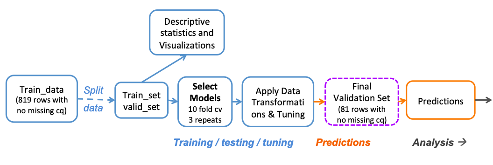
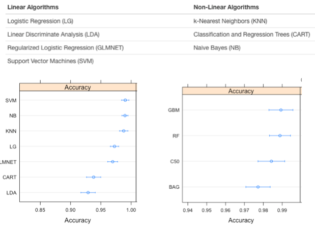
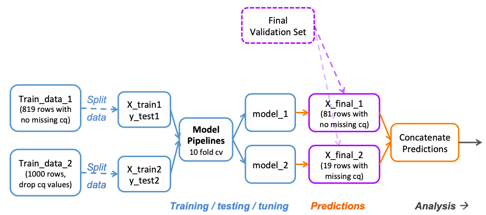
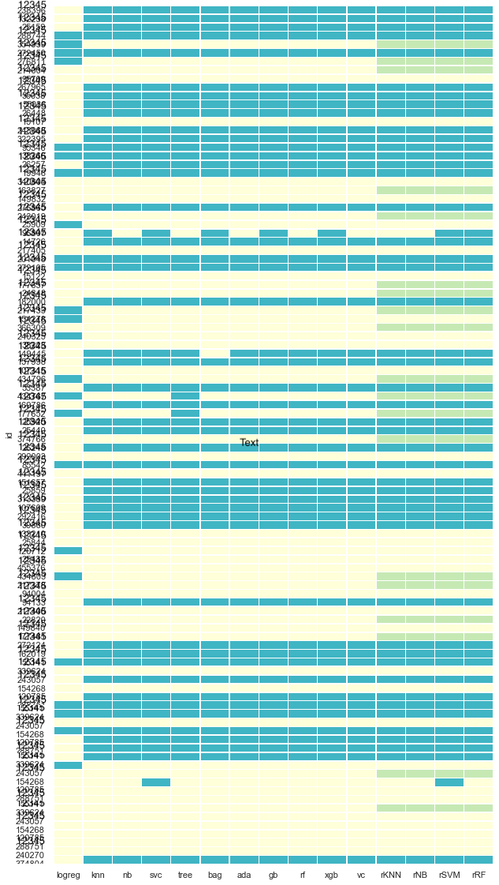

## Classifying qPCR Cancer Mutation data

Created machine learning models in R and Python to classify qPCR curves of cancer data as mutation or no mutation. 

#### The data

qPCR curve variables for learning: 
1. Cq
2. Baseline
3. Plateau
4. Slope
5. Inflection
6. Asymmetry
7. Drift

To predict: 
CurveCall. If True, this curve represents a mutation. If False, it does not

#### R 

#### R results
All models show promising mean accuracy over 90%
Random Forest performs the best with mean accuracy of 0.99
Yeo-johnson transformation gave best results

#### Python 

#### Exploratory analysis in Python 
In the training set, there appears to be correlation between cq and inflection. 
In the validation set, there appears to be correlation between cq and inflection
Greatest variation in cq, slope, inflection, asymmetry between False and True

#### Preliminary model comparison Python 

#### Final results (Python and R)
Visualized final predictions as a binary heat map. Out of the 100 test samples, 99 samples were curves were classified correctly--with models in close agreeance. 

#### Best performing models (in no particular order): 
- Random Forest
- Naive Bayes
- XGBoost Classifier 
- Gradient Boosting Classifier 
- AdaBoost
- K-Nearest Neighbor 
- Voting Classifier 
- Bagging Classifier

Less well performing models(with more tuning better models may be possible):
- Decision Tree (would have been nice and interpretable) 
- Support Vector Machine Classifier
- Log Regression
